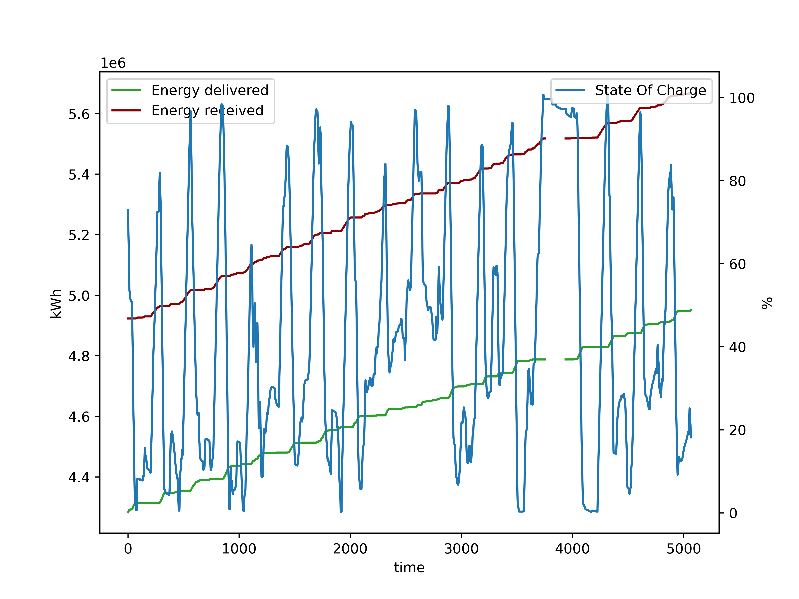
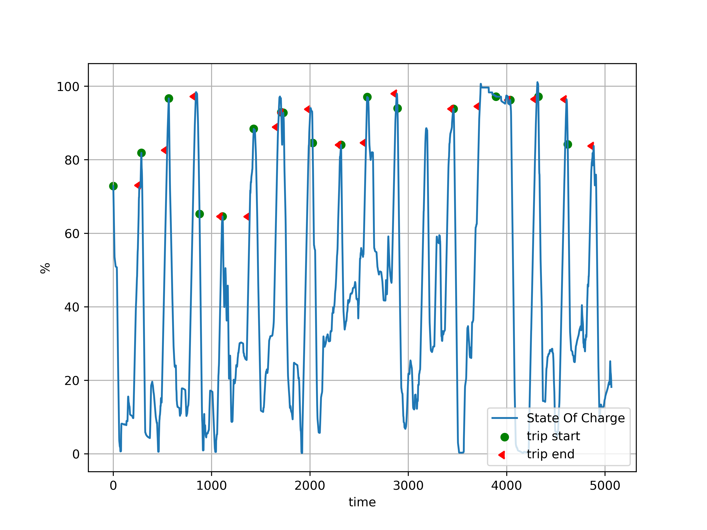

### Round trip efficiency estimation for Battery Energy Storage Systems

We start from a dataset describing the energy delivered and received by the battery.
 There are no "proper" round trips, which go from 100% charge to 0% and then back to %, and would allow us to directly compute the Round-trip efficiency (RTE).

Since we do not have round trips, we estimate the RTE from the next best thing:
segments of the State-Of-Charge curve that start at a local maximum, discharge and then recharge reaching the original SOC. 
We call such segments **trips**:

Eventually, using the data in `BESS_op_data.csv`:  
Average RTE over 16 trips = 86.33%  
Average RTE over 16 trips (weighted by each trip's Δ SOC) = **86.27%**

